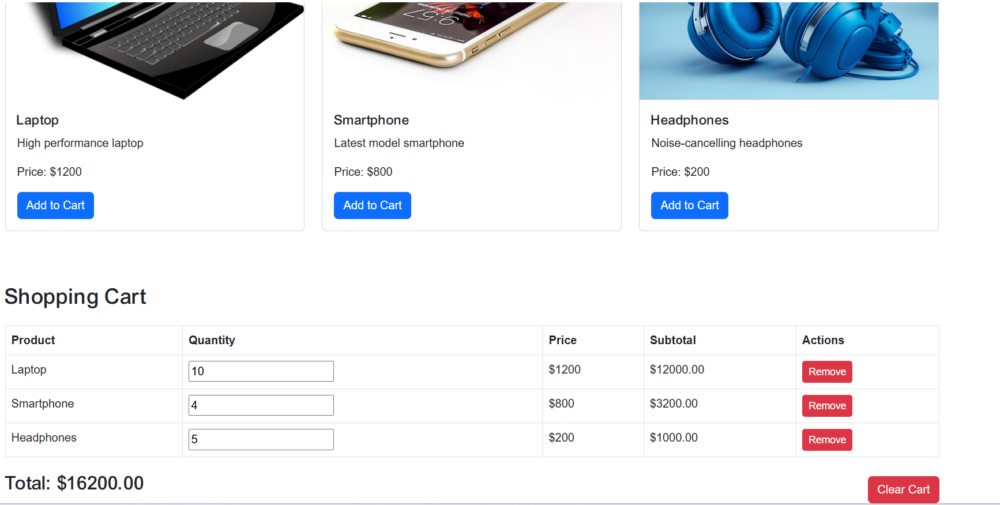

# Shopping-Cart-project-using-HTML-CSS-JavaScript
Create a simple Shopping Cart project using HTML, CSS &amp; JavaScript.

# Output

---
<h1>Visit Live: http://shoppingcart.tanvirinfo.com/</h1>

---

---

<!-- all link is here -->

### Contact me:

[E-mail]( tanvirpoly@gmail.com)

[Linkedin]( https://www.linkedin.com/in/tanvirpoly/)

[Facebook]( https://www.facebook.com/tanvirfbid)

